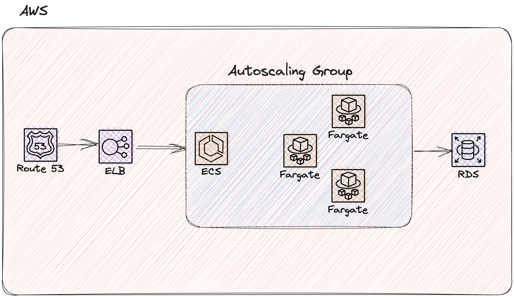

# Ajuda API

Esse é o back-end do app Ajuda, uma aplicação para atendimento médico online feito exclusivamente para a cidade de Embu-Guaçu.

## Tecnologias utilizadas

- Go
- Docker
- Gofiber v2
- PostgreSQL
- Migrations
- Hexagonal Architecture
- Shell script
- Windows bat script
- Terraform

## Composição da infraestrutura



## Como utilizar?

1. Você precisa ter o Go instalado e configurado na sua máquina
2. Você precisa do Docker instalado na sua máquina e em execução
3. Se você utiliza sistemas unix-like, execute esse comando na pasta raíz do projeto(pelo terminal): `./local/run-local-linux.sh`
4. Se você utiliza Windows, execute esse comando na pasta raíz do projeto(pelo prompt ou PowerShell): `C:\local\run-local-windows.bat`

Esse comando irá construir o banco de dados e iniciar a aplicação localmente na sua máquina.

## Swagger

Acesse a documentação da API em:

- Local: `http://localhost:8080/swagger`
- Produção: `https://api.ajuda.academy/swagger`

## Teste unitário

### Executando teste unitário com cobertura
```shell
go test -v ./tests/unit -cover -coverpkg=./application/domains/paciente/services/... -coverprofile=coverage.out
```

### Exibir cobertura de teste unitário no browser

```shell
go tool cover -html=coverage.out
```

## Variáveis de ambiente local

```text
DATABASE_HOST=127.0.0.1
DATABASE_PORT=5432
DATABASE_USER=postgres
DATABASE_PASS=postgres
DATABASE_NAME=postgres
ENV=local
```

**Created with** :heart: by [Rodolfo Azevedo](https://github.com/rof20004)
